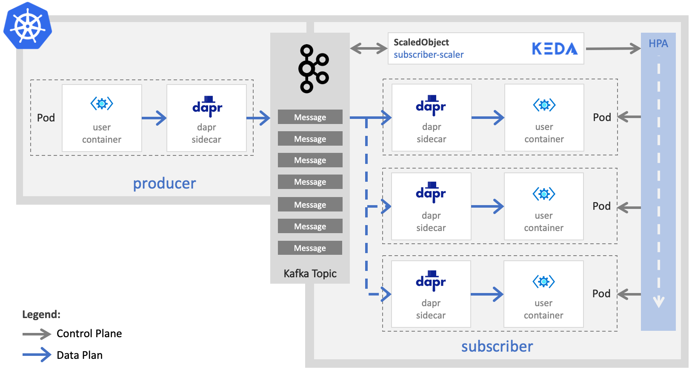

# Autoscaling Dapr service based on queue depth 

Dapr, with its building blocks and 10+ Pub/Sub components makes it super easy to write message processing applications. But, since Dapr can run in a VM, on bare-metal, in the Cloud, or on the Edge... it leaves the autoscaling to hosting later. 

In case of Kubernetes, Dapr integrates with [Keda](https://github.com/kedacore/keda), an event driven autoscaler for Kubernetes. In this demo I'm going to walk through the setup and configuration of Dapr microservice for scaling based on the depth of [Kafka](https://kafka.apache.org) queue. 



## Setup 

The autoscaling demo requires [Dapr](https://dapr.io). If you don't already have a Kubernetes cluster with Dapr installed you can use the included [setup](../setup) to configure all the dependencies. 

### Keda 

Start by install [Keda](https://github.com/kedacore/keda) into the cluster and wait for it become ready:

```shell
kubectl apply -f deployment/keda-2.0.0-beta.yaml
kubectl rollout status deployment.apps/keda-operator -n keda
```

### Kafka 

Next, install Kafka into the cluster:

```shell
helm repo add confluentinc https://confluentinc.github.io/cp-helm-charts/
helm repo update
kubectl create ns kafka
helm install kafka confluentinc/cp-helm-charts -n kafka \
		--set cp-schema-registry.enabled=false \
		--set cp-kafka-rest.enabled=false \
		--set cp-kafka-connect.enabled=false \
		--set dataLogDirStorageClass=default \
		--set dataDirStorageClass=default \
		--set storageClass=default
kubectl rollout status deployment.apps/kafka-cp-control-center -n kafka
kubectl rollout status deployment.apps/kafka-cp-ksql-server -n kafka
kubectl rollout status statefulset.apps/kafka-cp-kafka -n kafka
kubectl rollout status statefulset.apps/kafka-cp-zookeeper -n kafka
```

When done, also deploy Kafka client and wait until it's ready:

```shell
kubectl apply -n kafka -f deployment/kafka-client.yaml
kubectl wait -n kafka --for=condition=ready pod kafka-client --timeout=120s
```

Next, create the `metric` topic which we will use in this demo:

> The number of `partitions` is connected to the maximum number of replicas Keda will create. 

```shell
kubectl -n kafka exec -it kafka-client -- kafka-topics \
		--zookeeper kafka-cp-zookeeper-headless:2181 \
		--topic metric \
		--create \
		--partitions 10 \
		--replication-factor 3 \
		--if-not-exists
```

## Deployment

To configure the autoscaling demo we will deploy two deployments: `subscriber` which will be processing messages of the `metric` queue in Kafka, and the `producer` which will be publishing messages onto the Kafka queue using Dapr APIs. 

### Subscriber

The `subscriber` doesn't really do anything with the messages, so to resemble real-life processing it allows for explicit processing time setting. The default value is `300ms`. We will go over how to modify that later. 

To deploy the `subscriber` service, apply the [Kafka Dapr component](deployment/kafka-pubsub.yaml), the [message subscriber service](deployment/subscriber.yaml), and the [subscriber service Keda scaler](subscriber-scaler.yaml):

```shell
kubectl apply -f deployment/kafka-pubsub.yaml
kubectl apply -f deployment/subscriber.yaml
kubectl apply -f deployment/subscriber-scaler.yaml
```

When done, start watching for the number of replicas of the deployed `subscriber` service: 

```shell
watch kubectl get pods -l app=autoscaling-subscriber
```

> Note, by default the subscriber service Keda scaler is set to scale to 0, so you will not see anything pods yet. We will address that with the producer by creating some lag on the `metric` queue. 

### Producer

In a second terminal session, deploy the [producer service](deployment/producer.yaml) and wait for it to be ready:

```shell
kubectl apply -f deployment/producer.yaml
kubectl rollout status deployment/autoscaling-producer
```

## Demo 

Back in the initial terminal now, in 20-30 seconds after the `producer` starts, we should see the number of `subscriber` pods being adjusted by Keda based on the depth of the `metric` queue:

```shell
NAME                                      READY   STATUS    RESTARTS   AGE
autoscaling-subscriber-696ffb5c7b-64zqq   2/2     Running   0          31s
autoscaling-subscriber-696ffb5c7b-67f74   2/2     Running   0          15s
autoscaling-subscriber-696ffb5c7b-gpc2d   2/2     Running   0          7m42s
```

By default the `subscriber-scaler` is set to scale-to-zero and has the polling frequency of `15s`. You can adjust these values in [deployment/subscriber-scaler.yaml](deployment/subscriber-scaler.yaml):

```yaml
pollingInterval: 15
minReplicaCount: 0
maxReplicaCount: 10
cooldownPeriod: 30
```

To modify how long should the `subscriber` take to process each message adjust `PROCESS_DURATION` in [deployment/subscriber.yaml](deployment/subscriber.yaml) and re-apply it to the cluster:

```yaml
- name: PROCESS_DURATION
  value: "300ms"
```

Finally, to adjust the number of messages published by the producer change the `producer` in [deployment/producer.yaml](./deployment/producer.yaml) and re-apply it to the cluster:


```yaml
- name: NUMBER_OF_PUBLISHERS
  value: "1"
- name: PUBLISHERS_FREQ
  value: "100ms"
```

The `NUMBER_OF_PUBLISHERS` setting is number of channels that are used to publish events (default: 1). And the `PUBLISHERS_FREQ` is the frequency with which each channel publishes events (default: 1s). 

> There is a limit to the amount of messages a single container can produce. If you need to scale beyond that number, increase the number of `autoscaling-producer` replicas

```shell
kubectl scale -n kafka deployment/autoscaling-producer --replicas=10 
```

### Updating Components 

If you have changed already deployed Dapr component, make sure to reload the `subscriber` and `producer` deployments:

```shell
kubectl rollout restart deployment/autoscaling-subscriber
kubectl rollout status deployment/autoscaling-subscriber
kubectl rollout restart deployment/autoscaling-producer
kubectl rollout status deployment/autoscaling-producer
```

### Kafka Helpers 

Get `metric` topic offsets for `autoscaling-subscriber` consumer group:

```shell
kubectl -n kafka exec -it kafka-client -- kafka-consumer-groups \
	--bootstrap-server kafka-cp-kafka:9092 \
	--describe \
	--group autoscaling-subscriber
```

Purge the `metric` topic:

```shell
kubectl -n kafka exec -it kafka-client -- kafka-topics \
	--zookeeper kafka-cp-zookeeper:2181 \
	--alter \
	--topic metric \
	--config retention.ms=1000
sleep 15
kubectl -n kafka exec -it kafka-client -- kafka-topics \
	--zookeeper kafka-cp-zookeeper:2181 \
	--alter \
	--topic metric \
	--delete-config retention.ms
```

Delete `metric` topic

```shell
kubectl -n kafka exec -it kafka-client -- kafka-topics \
	--zookeeper kafka-cp-zookeeper:2181 \
	--delete \
	--topic metric
```

## Cleanup 

```shell
kubectl delete -f deployment/producer.yaml
kubectl delete -f deployment/kafka-pubsub.yaml
kubectl delete -f deployment/subscriber.yaml
kubectl delete -f deployment/subscriber-scaler.yaml
kubectl delete -f deployment/keda-2.0.0-beta.yaml
```

## Disclaimer

This is my personal project and it does not represent my employer. While I do my best to ensure that everything works, I take no responsibility for issues caused by this code.

## License

This software is released under the [MIT](../LICENSE)
