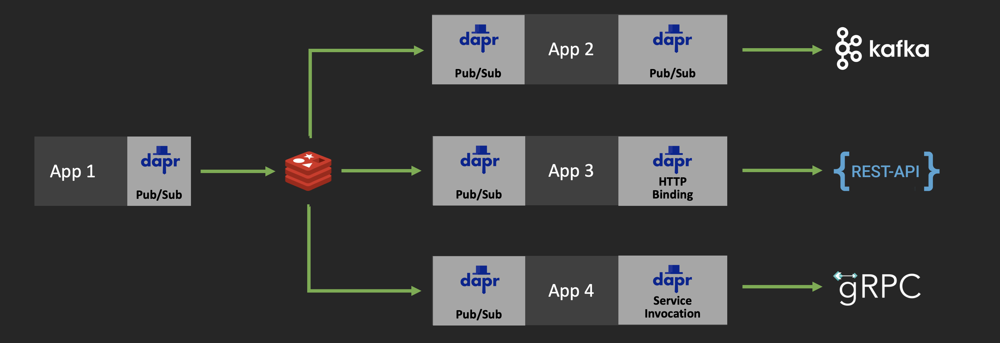

# fan-out demo 

`Fan-out` is a messaging pattern where single message source is "broadcasted" to multiple targets. The common use-case for this may be situation where multiple teams or systems need to receive the events from the same source. This sometimes made more complicated by the differences in expected formats and protocols by each one of these target systems. 

This demo illustrates how to `fan-out` events from Azure Event Hubs using Dapr plugable component mechanism to:

* Redis queue in XML format 
* Kafka topic in CSV format 
* REST endpoint in JSON format 
* gRPC service in binary format 



For more information about Dapr's pub/sub see these [docs](https://github.com/dapr/docs/tree/master/concepts/publish-subscribe-messaging)

## Setup 

To run these demos you will have first create a secret file (`secrets.json`) in this directory with your Azure Event Hubs secrets

```json
{
    "eventhubConnStr": "***",
    "storageAccountKey": "***"
}
```

In addition, you will need access to Redis and Kafka services. Dapr installed Redis container during setup so you can use that. For Kafka, you can use the included Docker Compose file:

```shell
docker-compose -f ./queue-format-converter/config/kafka.yaml up -d
```

## Events 

For this demo we will need an event source. Start by, create your Event Hubs (if you don't already have one) using [these instructions](https://docs.microsoft.com/en-us/azure/event-hubs/event-hubs-create). Then capture the connection string using [these instructions](https://docs.microsoft.com/en-us/azure/event-hubs/event-hubs-get-connection-string). 

To mock up events we will use the included `./eventmaker` utility which will generate random `temperature` and `humidity` events and publish them to the Event Hub. Navigate to the `./eventmaker` directory and run:

```shell
go run *.go --conn "your-eventhubs-connection-string"
```

> Make sure to replace the `your-eventhubs-connection-string` string with your Event Hubs connection string

The output should look something like this:

```shell
sending: {"id":"775ccb8f-8039-4c97-9849-15fdf6a26a1e","temperature":60.46998219508215,"humidity":94.05150371362079,"time":1598373738}
sending: {"id":"ef658e1f-a16d-4cc7-99a9-6e17d5542fb8","temperature":66.45935972131686,"humidity":43.77704157682614,"time":1598373740}
```

> You can leave this running during the demo, just remember to stop it on the end to avoid getting charge for the mocked up events. 

## Run 

With events on the Azure Event Hubs, you can now run each one of the fan-out distributors.

### Event Hubs to Pub/Sub

This step will subscribe to the Event Hub source using Dapr binding, convert into specified format, and publish them to the pre-configured Pub/Sub target. The specific Pub/Sub is defined by the Dapr component found in the `./config` directory. Dapr has a wide array of [Pub/Sub components](https://github.com/dapr/components-contrib/tree/master/pubsub#pub-sub) (e.g. Redis, NATS, Kafka, RabbitMQ...), for this example we will use Redis. 

To start, navigate to the directory (`cd ./queue-format-converter`)

#### XML 

```shell
export TARGET_TOPIC_FORMAT="xml" 
export TARGET_PUBSUB_NAME="fanout-queue-redis-target"
```

Now run the service using Dapr:

```shell
dapr run \
    --app-id redis-xml-publisher \
    --app-port 60010 \
    --app-protocol grpc \
    --components-path ./config \
    go run main.go
```

#### CSV

```shell
export TARGET_TOPIC_FORMAT="csv" 
export TARGET_PUBSUB_NAME="fanout-queue-kafka-target"
export ADDRESS=":60020"
```

Now run the service using Dapr:

```shell
dapr run \
    --app-id kafka-csv-publisher \
    --app-port 60020 \
    --app-protocol grpc \
    --components-path ./config \
    go run main.go
```

#### Output

The terminal output should include the received event and the event that was published to the target

```shell
== APP == Source: {"id":"8453c94e-1ff0-47d1-b0f9-7936c5be3d98","temperature":51.52611072392151,"humidity":81.36585969939978,"time":1598361172}
== APP == Target: <SourceEvent><ID>8453c94e-1ff0-47d1-b0f9-7936c5be3d98</ID><Temperature>51.52611072392151</Temperature><Humidity>81.36585969939978</Humidity><Time>1598361172</Time></SourceEvent>
```

### Event Hubs to REST endpoint in JSON format

This step will subscribe to the Event Hub source using Dapr binding, convert the incoming events into JSON, and publish them to the pre-configured REST endpoint using Dapr HTTP binding. The specific endpoint as well as method (`POST` vs `GET` for example) is defined by the Dapr component found in the `./config` directory. Dapr has a wide array of [output bindings](https://github.com/dapr/docs/tree/master/concepts/bindings#supported-bindings-and-specs) (e.g. Twilio, SendGrid, MQTT...), for this example we will use HTTP. 

> To change the target, simply update the [http-format-converter/config/target-binding.yaml](./http-format-converter/config/target-binding.yaml) file with the desired output binding.

To start, navigate to the directory (`cd ./http-format-converter`) and export the desired format:

```shell
export TARGET_TOPIC_FORMAT="json" 
```

Now run the service using Dapr:

```shell
dapr run \
    --app-id http-json-publisher \
    --app-port 60011 \
    --app-protocol grpc \
    --components-path ./config \
    go run main.go
```

The terminal output should include the received event and the event that was published to the target

```shell
== APP == Target: {"id":"ef658e1f-a16d-4cc7-99a9-6e17d5542fb8","temperature":66.45935972131686,"humidity":43.77704157682614,"time":1598373740}
```

### Event Hubs to gRPC service in binary format 

This step will subscribe to the Event Hub source using Dapr binding, convert the incoming events into target service expecting format, and publish them to the Dapr service identified by name. The discovery of the target service as well as the mTLS encryption and protocol translation (if necessary in case HTTP to gPRC or gPRC to HTTP invocation) are handled automatically by Dapr. You can learn more about the service to service invocation in Dapr [here](https://github.com/dapr/docs/blob/master/concepts/service-invocation/README.md#service-invocation)

> For purposes of this demo, we are going to use the [grpc-echo-service](../grpc-echo-service). You will need to start that service before this one. You can find instructions [here](../grpc-echo-service)

To start, navigate to the directory (`cd ./service-format-converter`) and export the desired format:

```shell
export TARGET_SERVICE="grpc-echo-service"
export TARGET_METHOD="echo"
```

Now run the service using Dapr:

```shell
dapr run \
    --app-id grpc-service-publisher \
    --app-port 60012 \
    --app-protocol grpc \
    --components-path ./config \
    go run main.go
```

The terminal output should include the received event and the event that was published to the target

```shell
== APP == Source: {"id":"bc2e96cd-a3f0-4a49-bcdf-cda5d077449f","temperature":67.91167674526243,"humidity":21.8631197287505,"time":1598376230}
== APP == Target: &{Data:[123 34 105 100 34 58 34 98 99 50 101 57 54 99 100 45 97 51 102 48] ContentType:application/json}
```

## Disclaimer

This is my personal project and it does not represent my employer. I take no responsibility for issues caused by this code. I do my best to ensure that everything works, but if something goes wrong, my apologies is all you will get.

## License

This software is released under the [MIT](./LICENSE)
