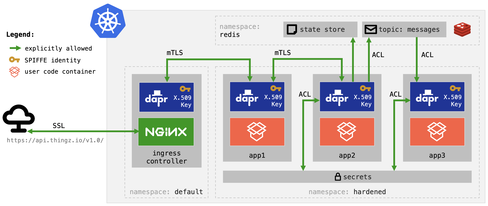

# hardened demo 

In addition to support for namespace isolation and Role-Based Access Control (RBAC) authorization, Dapr also provides additional, more granular, control options which can be used to harden application deployment in Kubernetes. 



This demo will overview: 

* In-transit encryption for all sidecar-to-sidecar communication using mutual TLS
* Cross-namespace service invocation with [SPIFFE](https://spiffe.io/) identity verification 
* Trust relationship management using "trustDomain" logical grouping
* Per-operation access control settings, down to verb level (e.g. only POST on /op1)
* Component scoping (i.e. which app should be able to access a given component)
* Pub/Sub topic scoping (which app should be able to publish or subscriber to a given topic)
* Per-application secret access control (i.e. which secrets the app should be able to access)

> You can replicate this demo on any Kubernetes cluster configured with Dapr. To demo the cross-namespace service invocation you will need "dapr'ized' cluster ingress (ingress with Dapr sidecar). You can setup fully configured Dapr cluster with all these dependencies using included [Dapr cluster setup](../setup).

## Setup 

In Kubernetes, namespaces provide way to divide cluster resources between multiple users. To isolate all the microservices in this demo, first, create a namespace. 

> For purposes of this demo, the namespace will be called `hardened`.

```shell
kubectl create namespace hardened
```

To illustrate Dapr components like PubSub and State, this demo will use Redis. To showcase the declarative access control for applications over secrets this demo will use Redis password defined in the `hardened` namespace.

> If this is Redis on your cluster you can look it up using `kubectl get svc nginx-ingress-nginx-controller -o jsonpath='{.status.loadBalancer.ingress[0].ip}'` and define the `REDIS_PASS` environment variable with that secret. 

```shell
kubectl create secret generic redis-secret \
    --from-literal=password="${REDIS_PASS}" \
    -n hardened 
```

## Deploy

With the namespace configured and the Redis password created, it's time to deploy:

* [app1.yaml](./k8s/app1.yaml), [app2.yaml](./k8s/app1.yaml), and [app2.yaml](./k8s/app1.yaml) are the Kubernetes deployments with their Dapr configuration.
* [pubsub.yaml](./k8s/pubsub.yaml) and [state.yaml](./k8s/state.yaml) are the configuration files for PubSub and State components using Redis
* [role.yaml](./k8s/role.yaml) defines the Role and RoleBinding required for Dapr application access the Kubernetes secrets in the `hardened` namespace.

> This demo uses [prebuilt images](https://github.com/mchmarny?tab=packages&q=hardened-app). You can review the code for these 3 applications in the [src](./src) directory.

Now, apply the demo resources to the cluster.

```shell
kubectl apply -f k8s/ -n hardened
```

The response from the above command should confirm that all the resources were configured.

```shell
deployment.apps/app1 configured
configuration.dapr.io/app1-config configured
deployment.apps/app2 configured
configuration.dapr.io/app2-config configured
deployment.apps/app3 configured
configuration.dapr.io/app3-config configured
component.dapr.io/pubsub configured
role.rbac.authorization.k8s.io/secret-reader configured
rolebinding.rbac.authorization.k8s.io/dapr-secret-reader configured
component.dapr.io/state configured
```

## Verify 

To ensure the rest of the demo goes smoothly, check that everything was deployed correctly.

```shell
kubectl get pods -n hardened
```

The response should include `app1`, `app2`, and `app3` pods with the status `Running` and the ready state of `2/2` indicating that the Dapr sidecar has been injected.

```shell
NAME                    READY   STATUS    RESTARTS   AGE
app1-6df587fb45-k46sz   2/2     Running   0          40s
app2-685fd94f69-5vkwl   2/2     Running   0          40s
app3-6d57778cbd-mxn2k   2/2     Running   0          40s
```

## Demo 

Start by exporting the API token from the cluster ingress.

```shell
export API_TOKEN=$(kubectl get secret dapr-api-token -o jsonpath="{.data.token}" | base64 --decode)
```

Now invoke the `ping` method on `app1` in the `hardened` namespace over the Dapr API on the NGNX ingress.

```shell
curl -i -d '{ "message": "hello" }' \
     -H "Content-type: application/json" \
     -H "dapr-api-token: ${API_TOKEN}" \
     https://api.thingz.io/v1.0/invoke/app1.hardened/method/ping
```

Dapr should respond with HTTP status code `200`, parent trace ID for this invocation (`traceparent`), and a JSON count payload with the nano epoch timestamp. 

```shell
HTTP/2 200
date: Sun, 25 Oct 2020 12:05:56 GMT
content-type: text/plain; charset=utf-8
content-length: 39
traceparent: 00-ecbbc473826b3e328ea00f5ac0ce222b-0824d3896092d8ce-01
strict-transport-security: max-age=15724800; includeSubDomains

{ "on": 1603627556200126373, "count": 8 }
```

### Tests

To simulate any other app trying to invoke `app1`, first forward the local port to any other Dapr sidecar on that cluster.

```shell
kubectl port-forward deployment/app2 3500 -n hardened
```

And then invoke the `/ping` method on the `app1`

```shell
curl -i -d '{ "message": "hello" }' \
     -H "Content-type: application/json" \
     http://localhost:3500/v1.0/invoke/app1/method/ping
```

The response will look include `PermissionDenied` message 

```json
{
  "errorCode": "ERR_DIRECT_INVOKE",
  "message": "rpc error: code = PermissionDenied desc = access control policy has denied access to appid: app2 operation: ping verb: POST"
}
```

> Similarly, you can repeat that test on other apps by forwarding, for example, the local port to the Dapr sidecar in `app3` and trying to invoke the `/counter` method on `app1`. 

## Restart 

If you update components you may have to restart the deployments.

```shell
kubectl rollout restart deployment/app1 -n hardened
kubectl rollout restart deployment/app2 -n hardened
kubectl rollout restart deployment/app3 -n hardened
kubectl rollout status deployment/app1 -n hardened
kubectl rollout status deployment/app2 -n hardened
kubectl rollout status deployment/app3 -n hardened
```

## Cleanup

```shell
kubectl delete -f k8s/ -n hardened
kubectl delete secret redis-secret -n hardened
kubectl delete ns hardened
```

## Disclaimer

This is my personal project and it does not represent my employer. While I do my best to ensure that everything works, I take no responsibility for issues caused by this code.

## License

This software is released under the [MIT](../LICENSE)
