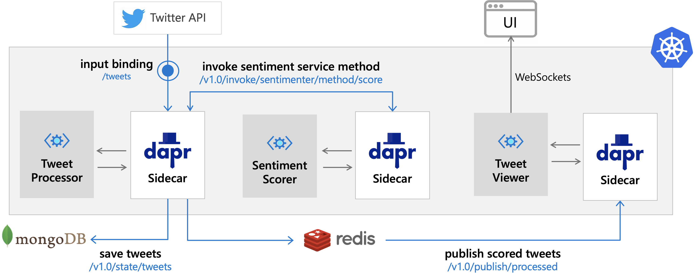

# Dapr pipeline demo 

Dapr supports a wide array of state and pubsub building clocks across multiple OSS, Cloud, and on-prem services. This demo will show how to use a few of these components to build tweet sentiment pipeline




## Run in standalone mode

### Setup 

To run these demos locally, you will have first create a secret file (`pipeline/secrets.json`). These will be used by Dapr components at runtime. To get the Twitter API secretes you will need to register your app [here](https://developer.twitter.com/en/apps/create).

```json
{
    "Twitter": {
        "ConsumerKey": "",
        "ConsumerSecret": "",
        "AccessToken": "",
        "AccessSecret": ""
    }
}
```


### Start tweet viewer app 

Navigate to the [tweet-viewer](./tweet-viewer) directory and run:

```shell
cd tweet-viewer
	dapr run \
    --app-id tweet-viewer \
    --app-port 8084 \
    --app-protocol http \
    --components-path ./config \
    go run main.go
```

Once the app starts, you should be able to navigate to http://localhost:8084/. There won't be anything there yet, but if you see `connection: open` in the top right corner that means the WebSocket connection to the back-end is established. 


### Start sentiment scoring service 

Navigate to the [sentiment-scorer](./sentiment-scorer) directory and run:

```shell
cd sentiment-scorer
dapr run \
    --app-id sentiment-scorer \
    --app-port 60005 \
    --app-protocol grpc \
    --components-path ./config \
    go run main.go
```

The last line from the above command should be

```shell
✅  You're up and running! Both Dapr and your app logs will appear here.
```

### Start tweet processing service 

Navigate to the [tweet-processor](./tweet-processor) directory and run:

```shell
cd tweet-processor
dapr run \
    --app-id tweet-processor \
    --app-port 60002 \
    --app-protocol grpc \
    --components-path ./config \
    go run main.go
```

The last line from the above command should be

```shell
✅  You're up and running! Both Dapr and your app logs will appear here.
```


### Start tweet provider

Navigate to the [tweet-provider](./tweet-provider) directory and run:

```shell
cd tweet-provider
dapr run \
		--app-id tweet-provider \
    --app-port 8080 \
    --app-protocol http \
    --components-path ./config \
    go run main.go
```

The last line from the above command should be

```shell
✅  You're up and running! Both Dapr and your app logs will appear here.
```

### View sentiment scored tweets in the UI 

Navigate once more to http://localhost:8084/ and provided there were tweets matching your query you should now see tweets displayed in the UI. 


## Run on Kubernetes 

> This section is WIP. Use the individual Makefiles located in each app to deploy to Kubernetes for now. 

### tweet-processor

Deploy and wait for the pod to be ready 

```shell
kubectl apply -f k8s/component.yaml
kubectl apply -f k8s/deployment.yaml
```

If you have changed an existing component, make sure to reload the deployment and wait until the new version is ready

```shell
kubectl rollout restart deployment/grpc-event-subscriber
kubectl rollout restart deployment/nginx-ingress-nginx-controller
kubectl rollout status deployment/nginx-ingress-nginx-controller
```

Follow logs

```shell
kubectl logs -l demo=tweet-processor -c service -f
```

In a separate terminal session export API token

```shell
export API_TOKEN=$(kubectl get secret dapr-api-token -o jsonpath="{.data.token}" | base64 --decode)
```

And invoke the service

```shell
curl -d '{ "from": "John", "to": "Lary", "message": "hi" }' \
     -H "Content-type: application/json" \
     -H "dapr-api-token: ${API_TOKEN}" \
     "https://api.cloudylabs.dev/v1.0/publish/grpc-events/messages"
```


# sentiment-scorer

Create a secret

```shell
kubectl create secret generic sentiment-secret --from-literal=token="your-azure-cognitive-service-token"
```

Deploy and wait for the pod to be ready 

```shell
kubectl apply -f deployment.yaml
kubectl rollout restart deployment/sentiment-scorer
kubectl rollout restart deployment/nginx-ingress-nginx-controller
kubectl rollout status deployment/nginx-ingress-nginx-controller
```

Follow logs

```shell
kubectl logs -l demo=sentiment -c service -f
```

In a separate terminal session export API token

```shell
export API_TOKEN=$(kubectl get secret dapr-api-token -o jsonpath="{.data.token}" | base64 --decode)
```

And invoke the service

```shell
curl -d '{ "text": "dapr is the best" }' \
    -H "Content-type: application/json" \
    -H "dapr-api-token: ${API_TOKEN}" \
    "https://api.cloudylabs.dev/v1.0/invoke/sentiment-scorer/method/sentiment"
```

Response should look something like this 

```json 
{ "sentiment":"positive", "confidence":1 }
```


# tweet-provider

Create secrets 

```shell
kubectl create secret generic twitter-secret \
  --from-literal=consumerKey=$TW_CONSUMER_KEY \
  --from-literal=consumerSecret=$TW_CONSUMER_SECRET \
  --from-literal=accessToken=$TW_ACCESS_TOEKN \
  --from-literal=accessSecret=$TW_ACCESS_SECRET
```

Deploy the `tweet-provider` service and its components

```shell
kubectl apply -f k8s/pubsub.yaml
kubectl apply -f k8s/twitter.yaml
kubectl apply -f k8s/deployment.yaml
```

If you have changed an existing component, make sure to reload the deployment and wait until the new version is ready

```shell
kubectl rollout restart deployment/tweet-provider
kubectl rollout status deployment/tweet-provider
```

Follow logs to see tweets for the "term" used in query

```shell
kubectl logs -l demo=twitter -c service -f
```


## Disclaimer

This is my personal project and it does not represent my employer. I take no responsibility for issues caused by this code. I do my best to ensure that everything works, but if something goes wrong, my apologies is all you will get.

## License

This software is released under the [MIT](../LICENSE)
